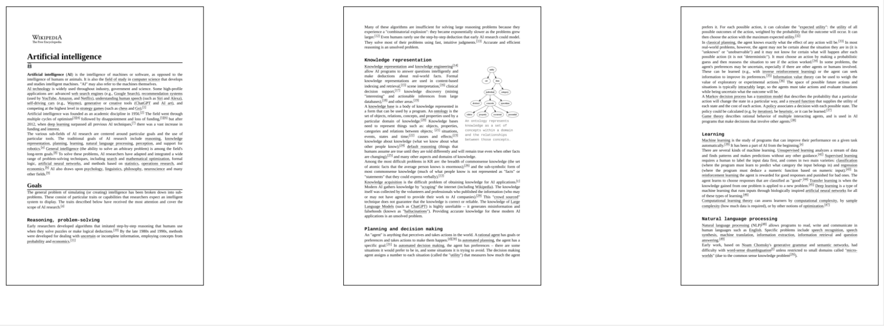
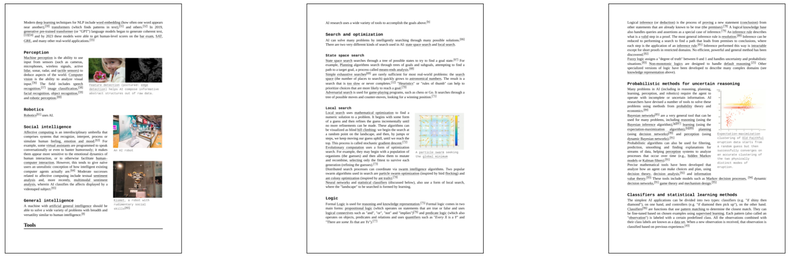
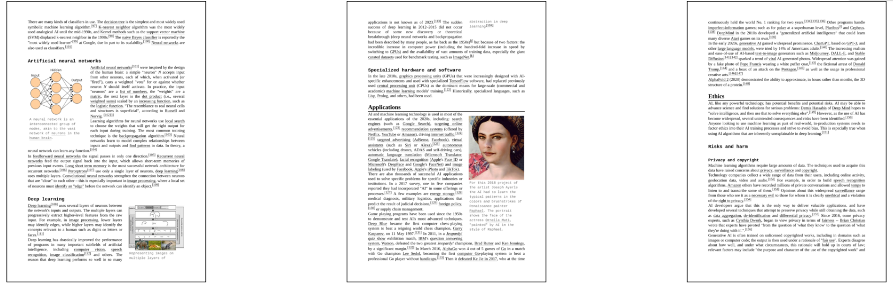
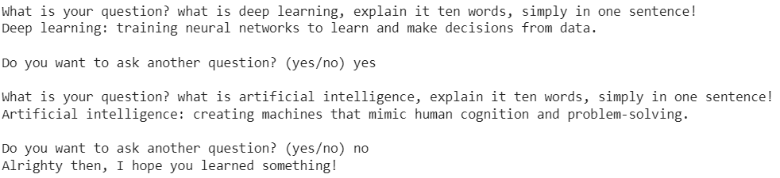

# Conversational-Q-A-OpenAI-Assistant-with-Q-A

It's an automation to scraping any website, getting the pdf file format of the context and conversational Q/A chatbot with OpenAI Assistant.

## How to Use it?

* Upload the python packages:

```
$> pip install -r requirements.txt
```

* Run the main

```
$> python main.py
```

* Apply OpenAI Key

* Provide a valid url.

## Results

* Result of the Scraped Data:





* Answers of the Chatbot:



## More

You can reach out my medium article which is [Build an OpenAI Assistant with Web Scraping](https://medium.com/@ilhnsevval/build-an-openai-assistant-with-web-scraping-09595357c5ed) to get more information about the project.